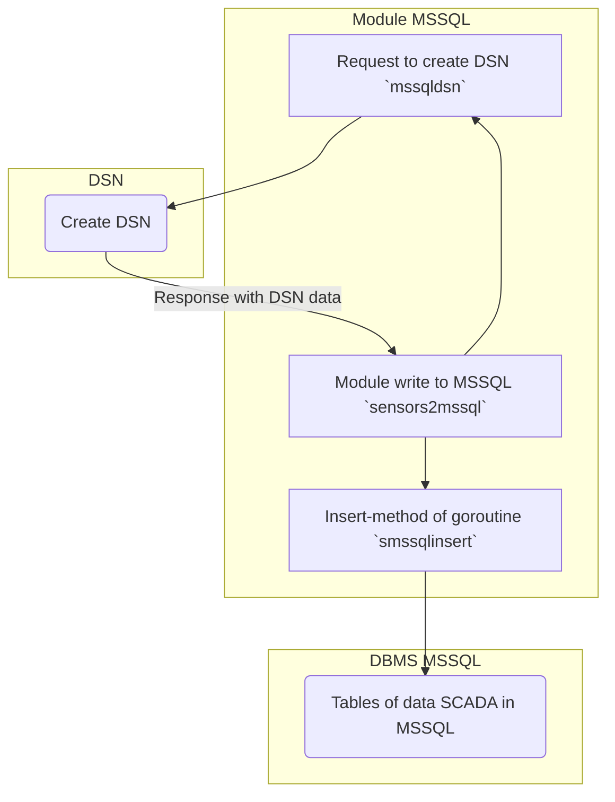

## scada
### RU

Демо пакеты для для записи данных в таблицу MSSQL за транзакцию.
Модуль `sensors2mssql` посредством модуля `mssqldsn` формирует DSN для подключения к БД, далее вызывается модуль `smssqlinsert` для записи данных. 

***Схема обмена данными (scheme exchange of data):***
			

Для проверки, запустить модуль [main4sensors](https://github.com/blablatov/scada4modbus2sensors.git), из строки браузера создать запрос:

	https://localhost:8443

### EN

Demo packages for writing data to MSSQL table per transaction.
The `sensors2mssql` module, using the `mssqldsn` module, forms a DSN for connecting to the database, next calls the `smssqlinsert` module to write data.

To check, run the [main4sensors](https://github.com/blablatov/scada4modbus2sensors.git) module, create a request from the browser line:

	https://localhost:8443

