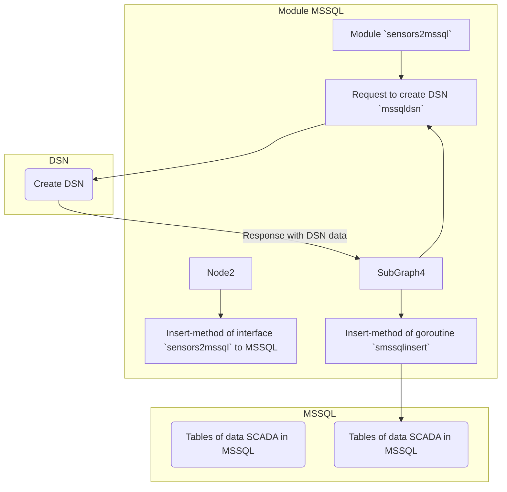

## scada
### RU

Демо модуль `sensors2mssql` через модуль `mssqldsn` формирует DSN для подключения к БД, вызывает MSSQL-модуль `smssqlinsert`, для записи данных в таблицу за транзакцию.

***Схема обмена данными (scheme exchange of data):***

> sensors2mssql <--->    
<---> :two::black_small_square::one:methods of interface (or goroutine)/mssqldsn   
<---> :two::black_small_square::two:methods of goroutine/smssqlinsert(MSSQL)
 			

Для проверки, запустить модуль [main4sensors](https://github.com/blablatov/scada4modbus2sensors.git), из строки браузера создать запрос:

	https://localhost:8443

### EN

Demo module `sensors2mssql` via module `mssqldsn` generates DSN to connect to the database, calls MSSQL module `smssqlinsert` to write data to the table per transaction.

To check, run the [main4sensors](https://github.com/blablatov/scada4modbus2sensors.git) module, create a request from the browser line:

	https://localhost:8443

